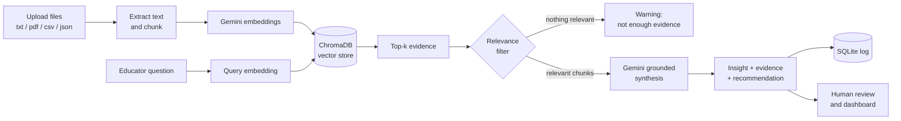

# 🎓 Coursera Multimodal Intelligence Platform

**Cross-modal RAG for learner friction detection.** Upload video transcripts, slides, quizzes and learner discussions, ask a question in plain English, and get a grounded insight with traceable evidence.

**Live demo:** `<add-your-streamlit-app-url-here>`

---

## The Problem

Online learning platforms hold a huge amount of evidence about where learners struggle: lecture videos, slides, quizzes and discussion threads. That evidence is scattered across separate systems and formats, so educators and content teams rarely see the full picture. A concept that confuses learners might show up as a low quiz score, a flood of forum questions and a tricky lecture segment, but nobody connects the three.

## The Solution

This platform builds a **single searchable layer across all of those content types**. An educator asks a question such as *"Why are students confused about regularization?"*. The system retrieves the most relevant evidence from every content type at once, and Gemini writes an insight **using only that evidence**. Each claim links back to the source chunk, so a human reviewer can verify it before acting on it.

If nothing relevant is found, the app says so instead of guessing.

---

## Features

- **Upload Data:** ingest `.txt`, `.pdf`, `.csv` and `.json` files. Content type is auto-detected from the file extension, or can be set manually.
- **Unified query:** one question searches video transcripts, slides, quizzes and discussions together.
- **Grounded insights:** Gemini returns an insight, a confidence level (high, medium or low) with a reason, and a concrete recommendation for the content team.
- **Traceable evidence:** an Evidence Panel lists the retrieved chunks with source, modality and relevance distance, and flags the ones actually used in the insight.
- **Relevance filter:** chunks farther than a configurable distance are dropped. If nothing relevant remains, Gemini is not called and the user sees a clear warning.
- **Human review:** reviewers can approve, reject or request revision on any insight, with an optional note.
- **Dashboard:** total queries, total reviews, confidence breakdown and reviewer decision breakdown.
- **Resilient LLM calls:** automatic retries for temporary errors (429 and 5xx) and a fallback Gemini model.

---

## How It Works



1. **Ingest:** an uploaded file is converted to text and split into paragraph-based chunks (about 900 characters each). Each chunk is tagged with its modality: `video`, `slide`, `quiz` or `discussion`.
2. **Embed:** chunks are embedded with `gemini-embedding-001` in batches, with retries.
3. **Store:** vectors, text and metadata go into ChromaDB.
4. **Retrieve:** the question is embedded and the nearest chunks across all modalities are returned.
5. **Filter:** chunks beyond `MAX_DISTANCE` are removed. If none remain, the app returns an "insufficient evidence" response without calling the LLM.
6. **Synthesize:** the remaining chunks are sent to Gemini with strict instructions to use only the provided evidence and to cite segment IDs. Cited IDs are validated against the real retrieved chunks, and an insight with no valid citation is downgraded to low confidence.
7. **Log and review:** every query is saved to SQLite and can be reviewed by a human.

### Supported content types

| File type | Auto-detected as | Typical use |
|---|---|---|
| `.txt` | Video transcript | Lecture transcripts with timestamps |
| `.pdf` | Slides | Slide decks and lecture notes |
| `.csv` | Quiz | Questions with correct-answer rates |
| `.json` | Discussion | Forum posts and learner questions |

Paragraphs should be separated by blank lines for the best chunking.

---

## Tech Stack

| Layer | Technology |
|---|---|
| Frontend | Streamlit |
| Backend | FastAPI, Uvicorn |
| Embeddings | Gemini `gemini-embedding-001` |
| Synthesis | Gemini `gemini-3.5-flash`, fallback `gemini-3.5-flash-lite` |
| Vector store | ChromaDB (persistent) |
| Database | SQLAlchemy with SQLite (query logs, reviews, metrics) |
| File parsing | pypdf, csv and json from the standard library |
| Deployment | Render (API), Streamlit Community Cloud (UI) |

---

## Project Structure

```
coursera-multimodal-mini/
├── ai/
│   ├── embeddings/
│   │   └── embedder.py         # Gemini embeddings: batching and retries
│   ├── preprocessing/
│   │   └── chunker.py          # Sample asset preprocessing
│   ├── retrieval/
│   │   └── retriever.py        # ChromaDB indexing and similarity search
│   └── synthesis/
│       └── synthesizer.py      # Grounded insight generation, validation, fallback
├── backend/
│   ├── api/
│   │   └── main.py             # FastAPI app and endpoints
│   └── database/
│       ├── db.py               # SQLAlchemy engine and session
│       └── models.py           # QueryLog and ReviewAction models
├── data/
│   ├── sample_assets/          # Built-in sample content
│   └── schemas/                # Segment and asset schemas
├── frontend/
│   └── app.py                  # Streamlit UI (4 tabs)
├── .env.example
├── requirements.txt
└── README.md
```

---

## API Reference

| Method | Endpoint | Description |
|---|---|---|
| `POST` | `/api/ingest` | Upload a file (form fields: `file`, `modality`, `source_title`), chunk it, embed it and index it |
| `POST` | `/api/query` | Body: `{"query": "...", "top_k": 5}`. Returns the insight and evidence |
| `GET` | `/api/insights/{id}` | Fetch a saved insight with its evidence and review history |
| `POST` | `/api/review-feedback` | Body: `{"query_log_id", "decision", "reviewer_note"}` where decision is `approved`, `rejected` or `needs_revision` |
| `GET` | `/api/metrics` | Dashboard metrics |
| `GET` | `/` | Health check |

Interactive docs are available at `/docs` (Swagger UI) when the server is running.

### Example insight response

```json
{
  "insight": "Learners confuse L1 and L2 regularization...",
  "evidence_used": ["upload_3f2a9c1b7d40", "upload_a81c5e02f9b3"],
  "confidence": "high",
  "confidence_reason": "Quiz results, forum posts and the lecture all point to the same gap.",
  "recommendation": "Add a worked example contrasting L1 and L2 weight shrinkage.",
  "model_used": "gemini-3.5-flash"
}
```

---

## Getting Started

### Prerequisites

- Python 3.10 or newer
- A [Gemini API key](https://aistudio.google.com/app/apikey)

### 1. Clone and install

```bash
git clone https://github.com/tejaswini-panda/Multimodal-Intelligence-Platform.git
cd Multimodal-Intelligence-Platform
python -m venv venv
venv\Scripts\activate          # Windows
# source venv/bin/activate     # macOS / Linux
pip install -r requirements.txt
```

### 2. Configure environment variables

Copy `.env.example` to `.env` and add your key:

```
GEMINI_API_KEY=your_key_here
```

| Variable | Required | Description |
|---|---|---|
| `GEMINI_API_KEY` | Yes | Gemini API key for embeddings and synthesis |
| `MAX_DISTANCE` | No | Relevance cutoff for retrieved chunks (default `1.0`). Lower is stricter |

Never commit your `.env` file. It is listed in `.gitignore`.

### 3. Run the backend

```bash
uvicorn backend.api.main:app --reload
```

The API runs at `http://127.0.0.1:8000` and the docs at `http://127.0.0.1:8000/docs`.

### 4. Run the frontend

In `frontend/app.py`, set `API_BASE` to your backend address:

```python
API_BASE = "http://127.0.0.1:8000"
```

Then start Streamlit in a second terminal:

```bash
streamlit run frontend/app.py
```

On the first query the backend indexes the built-in sample assets automatically if the vector store is empty.

---

## Using the App

1. **Upload Data:** choose files, keep *Auto-detect* selected (or pick a content type), and click **Ingest files**.
2. **Query Workspace:** ask a question about learner friction and click **Run Query**. Read the insight and open the Evidence Panel to check the sources.
3. **Review Workspace:** approve, reject or request revision on the latest insight.
4. **Dashboard:** track query volume, confidence levels and reviewer decisions.

---

## Design Notes and Limitations

- **Text-based modalities.** Every content type is represented as text (transcripts, slide text, quiz rows, forum posts) before embedding. The platform unifies multiple *content modalities* through text representations; it does not analyze raw video frames or images.
- **Chunking is simple.** Uploads are split on paragraph breaks with a maximum chunk size. PDFs without blank lines between paragraphs are cut at the size limit, which can split a sentence.
- **Storage on free hosting.** On free Render instances the disk is temporary, so uploaded data and logs are lost when the service restarts or redeploys. The sample assets are re-indexed automatically. Use a persistent disk or a hosted vector database for permanent storage.
- **Cold starts.** Free instances sleep after inactivity, so the first request can take up to a minute.
- **Open API.** The API has no authentication. Do not expose a deployment with a real API key to untrusted users.
- **Tuning the relevance filter.** The right `MAX_DISTANCE` depends on your content. The backend logs the distances of retrieved chunks to help you choose a value.

---

## Author

**Tejaswini Panda**

